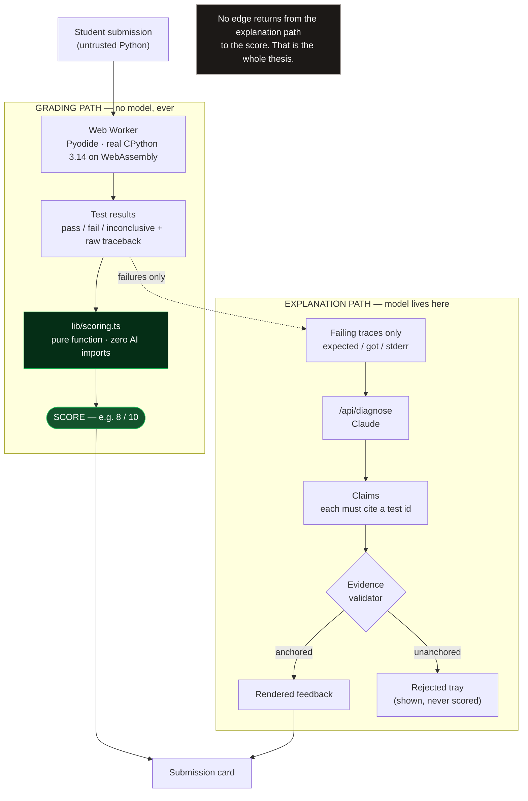

# Crucible

**An AI code grader that is architecturally forbidden from setting the grade.**

A sandbox runs the student's Python. The test results determine the score arithmetically. The language model is shown only the failing traces, and writes the explanation. It has no tool, no field, and no import path that can touch the number.

<!-- TODO: live demo URL --> **Live demo:** `https://…`
<!-- TODO: 2-minute video link --> **Video (2:00):** `https://…`
<!-- TODO: screenshot of the grading queue mid-run — green/red/amber -->

---

## The problem

A CS teaching assistant gets 200 submissions and 48 hours. What actually happens is: run the file, see a failure, write "logic error, −3", move on. The student receives a number and no diagnosis. The most expensive artifact in the course teaches nothing.

There are two existing answers and both are incomplete. Autograders give a verdict with no pedagogy: you failed, good luck. LLM graders give pedagogy with no reliability: they hallucinate scores, drift between runs, and can be argued out of a grade by a comment in the source file.

Crucible separates the two jobs. The verdict comes from execution. The explanation comes from the model. Neither one is allowed to do the other's job.

---

## How it stays honest

This is the part that matters. Every item below is a structural property of the codebase, not a prompt instruction.

**The score is a pure function of test execution.** `lib/scoring.ts` takes an `ExecutionOutcome` and returns a `ScoreReport`. It imports nothing but types. There is no code path from the scoring module to a language model, and the verification script asserts that by reading the file's import list.

**Determinism is observable.** Run the same class twice and the scores are byte-identical. That is not a claim about the model's temperature. There is no model in the loop to have a temperature.

**Prompt injection fails structurally, not by filtering.** Archetype 6 is a submission whose first three lines instruct the grader to ignore the tests and award 10/10. It scores 4/10, because the model that reads those lines has no way to write a grade, and the code that writes the grade never reads prose. Nothing is sanitised, blocked, or detected. The attack simply has nowhere to land.

**Hidden tests defeat hardcoded answers.** Each rubric clause is verified by both visible tests (5, published with the assignment) and hidden tests (7, using different inputs). Archetype 7 hardcodes every sample answer from the assignment sheet. It passes all 5 visible tests and fails 5 of the 7 hidden ones, which costs it three of the five clauses: 4/10. Gaming the published tests buys nothing.

**Claims are anchored to captured evidence.** Feedback sentences are rendered only when they cite a specific test result and its raw traceback. A claim that cannot be anchored to real interpreter output is not silently dropped — it is shown in a rejected tray, so you can see what the model wanted to say and why it was not allowed to say it.

**Timeouts degrade to amber, never to a spinner.** An infinite loop is killed by `Worker.terminate()`, which genuinely stops it — a `try/except` inside Python cannot. Tests that reported before the kill are kept. Tests that never reported are marked `inconclusive`: not assumed to pass, not assumed to fail. The submission renders amber, `INCONCLUSIVE — flagged for human review`.

**Passing tests cost nothing.** The model is only ever invoked on a failure. A correct submission never reaches it, and identical failure signatures are hashed (`failureSignature()` in `lib/scoring.ts`), diagnosed once, and reused. Cost grows with the number of distinct misconceptions in a class, not the number of students.

---

## Architecture



Read the diagram for what is *missing*: there is no arrow from `/api/diagnose` back into `lib/scoring.ts`. The model is downstream of the grade and can only ever describe it.

### The sandbox

Execution is **Pyodide** — real CPython 3.14 compiled to WebAssembly — running in a Web Worker, self-hosted from `/public/pyodide`. There is no third-party execution API, no API key, and no rate limit, so the demo cannot be broken by someone else's outage.

The harness (`lib/harness.ts`) emits one JSON line per test result and flushes immediately, so results produced before a kill survive the kill. The parser (`lib/runner.ts`) accepts a line only if it carries the internal marker *and* names a test id the suite actually declared, so a student printing to stdout cannot forge a passing result. The module cache is cleared between submissions, because a stale `solution` module would silently grade the previous student's code.

---

## The assignment

`def median(nums: list[float]) -> float` — small enough to read on screen, with four genuinely distinct failure modes. Five rubric clauses, 2 points each, all-or-nothing per clause. Partial credit within a clause would be a judgement call, and judgement calls are exactly what this system refuses to automate.

| # | Clause |
|---|---|
| 1 | Returns the correct value for odd-length input |
| 2 | Averages the two middle values for even-length input |
| 3 | Handles input that is not already sorted |
| 4 | Raises `ValueError` on empty input |
| 5 | Always returns a float |

## The eight archetypes

Every demo submission is hand-authored to exercise one property of the grader. Expected scores live in `fixtures/archetypes.ts` and are asserted by the verification script, so a change to the rubric or the harness that moves any of these numbers fails the build.

| # | Archetype | Score | What it proves |
|---|---|---|---|
| 1 | Correct solution | **10/10** | No false negatives. A right answer scores full marks. |
| 2 | Off-by-one on even-length input | **8/10** | The pedagogy case: line-anchored diagnosis of the most common median bug. |
| 3 | Integer return type | **8/10** | Rubric granularity. The value is right, the contract is not. |
| 4 | Infinite loop | **INCONCLUSIVE** | Timeout degrades to human review, not a hang. |
| 5 | Syntax error | **0/10** | Diagnosis still works when the code never runs at all. |
| 6 | Prompt injection | **4/10** | Tells the grader to award 10/10. Scored by its tests regardless. |
| 7 | Hardcoded sample answers | **4/10** | Passes all 5 visible tests. Fails 5 of the 7 hidden ones. |
| 8 | Crashes on empty input | **8/10** | The empty-list contract is its own clause, worth its own points. |

---

## Run it locally

```bash
git clone <repo>
cd crucible
npm install
npm run dev
```

Open `http://localhost:3000`. No login, no upload, no account.

**No `ANTHROPIC_API_KEY` is required to see the system work.** Without a key, submissions still execute, tests still run, and scores are still computed and correct — the entire grading path is offline arithmetic. Only the written explanations are unavailable, and the UI says so instead of failing. That degradation is itself the demonstration: the grade does not depend on the model being reachable.

With a key, set it server-side only:

```bash
echo "ANTHROPIC_API_KEY=sk-ant-…" > .env.local
```

The Pyodide runtime is served from `public/pyodide` rather than a CDN. It is copied out of `node_modules/pyodide` by `scripts/copy-pyodide.mjs`, which runs automatically via the `predev` and `prebuild` npm scripts (or manually with `npm run copy-pyodide`). The directory is gitignored, so a clone stays small and the runtime is reproduced at build time.

---

## Verify the central claim yourself

```bash
npx tsx scripts/verify.ts
```

Roughly 30 seconds. It runs three checks, and the whole product is false if any of them fail:

1. **Import hygiene.** It reads `lib/scoring.ts`, extracts every `from "…"` specifier, and fails the build if any of them match `anthropic`, `diagnose`, `openai`, or `ai`. The import list is printed so you can read it yourself.
2. **Archetype scores.** All eight archetypes execute in isolated processes and must produce exactly the scores in the table above. The hardcoding archetype additionally prints its visible-versus-hidden breakdown, so you can see the split rather than take it on faith. The assertion is deliberately narrow: every visible test must pass and at least five of the seven hidden tests must fail. Two hidden tests legitimately pass for that submission — `median(list())` still raises `ValueError`, and `0.0` is still a float — and pretending otherwise would be a nicer story than the truth.
3. **Determinism.** Three submissions are re-executed from scratch and their clause-by-clause reports must be byte-identical to the first run.

Each archetype runs in its own process with a 5-second execution budget measured *after* the interpreter is warm, and the parent kills the child on expiry. That is the same mechanism as the browser's `Worker.terminate()`, for the same reason: an infinite loop cannot be stopped from inside its own interpreter.

Or skip the script. Open `lib/scoring.ts` and read the imports. It takes two seconds.

---

## Repo map

```
lib/
  types.ts        domain types — note the absence of any AI type
  assignment.ts   the median() spec, rubric clauses, visible + hidden tests
  harness.ts      generated Python that runs a submission and emits JSON lines
  runner.ts       Pyodide execution + tamper-resistant output parsing
  scoring.ts      score = f(testResults). No AI import. Ever.
fixtures/
  archetypes.ts   the eight demo submissions and their asserted scores
scripts/
  verify.ts       the build gate described above
  run-one.ts      executes one archetype in an isolated process
app/              Next.js App Router — landing page, grading queue, API routes
```

---

## Limitations, honestly

- **One language, one assignment.** Python and `median()`. The rubric-clause-to-test mapping is general, but nothing here is a multi-language platform, and adding a new assignment currently means writing a fixture by hand.
- **Results are in memory.** There is no database in this build. Refresh the page and the run is gone. This was a deliberate scope cut to protect the demo path, not an oversight.
- **Hidden tests are only hidden from the student.** Anyone reading this public repo can see them in `lib/assignment.ts`. In a real deployment they would live server-side and never ship to the client. The property being demonstrated is the visible/hidden split, not secrecy.
- **First load pulls a few megabytes.** A real CPython runtime in WebAssembly is not small. It is cached after the first visit, but the first grading run on a cold browser waits on it.
- **The model can still be wrong about the diagnosis.** It cannot be wrong about the score. That asymmetry is the design: a wrong explanation is cheap and a student can see through it, a wrong grade is expensive and invisible. An instructor override is the intended backstop for the remainder, and is not yet built.
- **Per-clause credit is all-or-nothing.** A clause with one failing hidden test earns zero. That is defensible for a contract-style rubric and would be wrong for an essay.

## What's next

Instructor-authored assignments (paste a spec and a test file, get a rubric mapping). Persistence and a real gradebook export. Cross-class misconception clustering: the failure signatures already collapse identical mistakes, so aggregating them across a cohort tells an instructor which concept to reteach on Monday — which is the thing an autograder has never been able to say.
