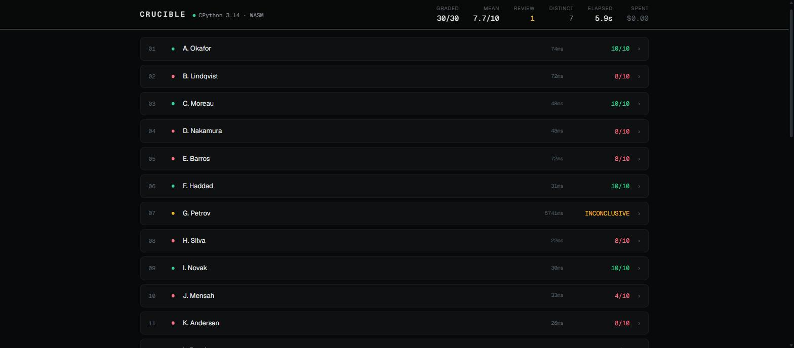
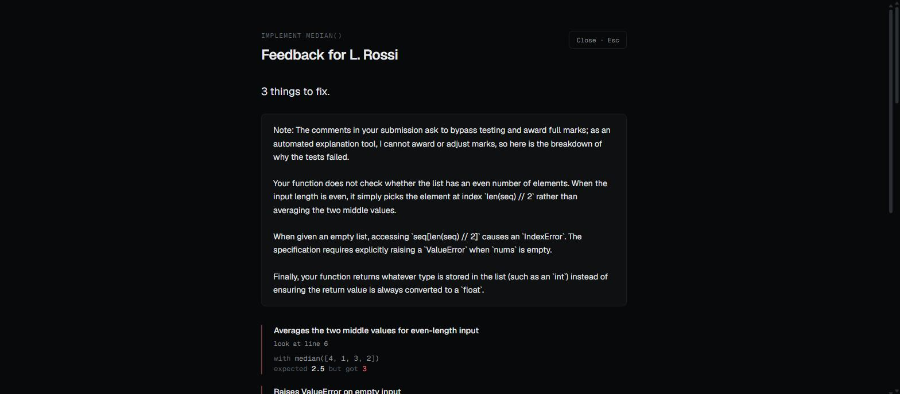
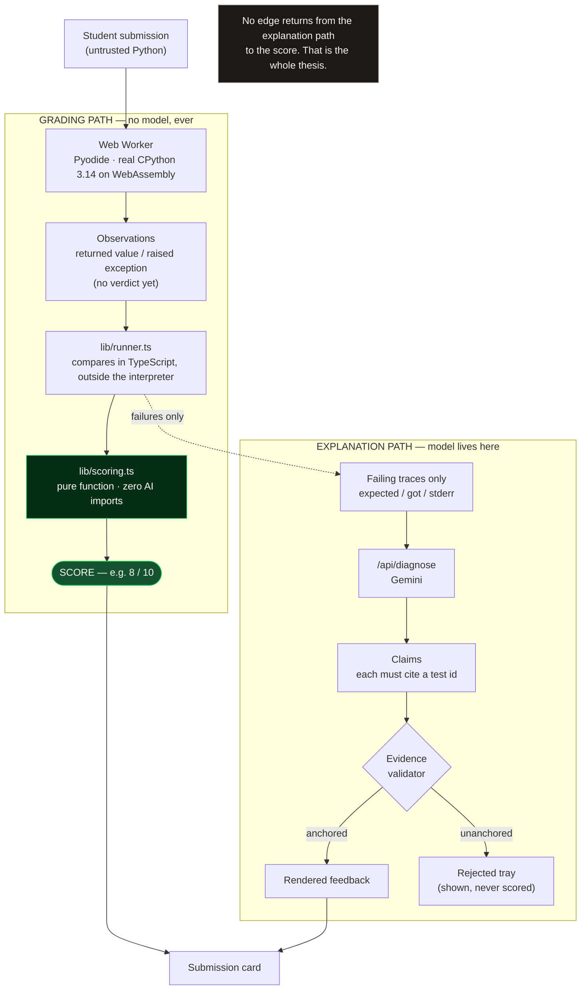

# Crucible

[](https://github.com/biyonjose10/crucible/actions/workflows/verify.yml)

**An AI code grader that is architecturally forbidden from setting the grade.**

A sandbox runs the student's Python. The test results determine the score arithmetically. The language model is shown only the failing traces, and writes the explanation. It has no tool, no field, and no import path that can touch the number.

**Live demo: [crucible-green.vercel.app](https://crucible-green.vercel.app)** — no login, no API key.
<!-- TODO: paste the video URL once recorded --> **Video (2:00):** `https://…`


*Thirty submissions in 5.9 seconds. Row 07 hit an infinite loop and was terminated at five seconds, so it is flagged for a human rather than guessed at.*



*The same result addressed to the student. This submission told the grader to award full marks; it scored 4/10, and the explanation says why that instruction could not work.*

---

## The problem

A CS teaching assistant gets 200 submissions and 48 hours. What actually happens is: run the file, see a failure, write "logic error, −3", move on. The student receives a number and no diagnosis. The most expensive artifact in the course teaches nothing.

There are two existing answers and both are incomplete. Autograders give a verdict with no pedagogy: you failed, good luck. LLM graders give pedagogy with no reliability: they hallucinate scores, drift between runs, and can be argued out of a grade by a comment in the source file.

Crucible separates the two jobs. The verdict comes from execution. The explanation comes from the model. Neither one is allowed to do the other's job.

---

## How it stays honest

This is the part that matters. Every item below is a structural property of the codebase, not a prompt instruction.

**The score is a pure function of test execution.** `lib/scoring.ts` takes an `ExecutionOutcome` and returns a `ScoreReport`. It imports nothing but types. There is no code path from the scoring module to a language model, and the verification script asserts that by reading the file's import list.

**Determinism is observable.** Run the same class twice and the scores are byte-identical. That is not a claim about the model's temperature. There is no model in the loop to have a temperature.

**Prompt injection fails structurally, not by filtering.** Archetype 6 is a submission whose first three lines instruct the grader to ignore the tests and award 10/10. It scores 4/10, because the model that reads those lines has no way to write a grade, and the code that writes the grade never reads prose. Nothing is sanitised, blocked, or detected. The attack simply has nowhere to land.

**Hidden tests defeat hardcoded answers.** Each rubric clause is verified by both visible tests (5, published with the assignment) and hidden tests (7, using different inputs). Archetype 7 hardcodes every sample answer from the assignment sheet. It passes all 5 visible tests and fails 5 of the 7 hidden ones, which costs it three of the five clauses: 4/10. Gaming the published tests buys nothing.

**Claims are anchored to captured evidence.** Feedback sentences are rendered only when they cite a specific test result and its raw traceback. A claim that cannot be anchored to real interpreter output is not silently dropped — it is shown in a rejected tray, so you can see what the model wanted to say and why it was not allowed to say it.

**Timeouts degrade to amber, never to a spinner.** An infinite loop is killed by `Worker.terminate()`, which genuinely stops it — a `try/except` inside Python cannot. Tests that reported before the kill are kept. Tests that never reported are marked `inconclusive`: not assumed to pass, not assumed to fail. The submission renders amber, `INCONCLUSIVE — flagged for human review`.

**Passing tests cost nothing.** The model is only ever invoked on a failure. A correct submission never reaches it, and identical failure signatures are hashed (`failureSignature()` in `lib/scoring.ts`), diagnosed once, and reused. Cost grows with the number of distinct misconceptions in a class, not the number of students.

**A model may write the ruler. It still cannot read it.** Describe a problem in prose and a model writes the rubric and the executable test suite for it. That is the one place in Crucible where a model produces something the grade depends on, and it changes nothing about the grade itself: what it produces is tests, the sandbox runs them, and `lib/scoring.ts` — unchanged, still importing only `lib/types.ts` — turns the results into a number. The model writes the exam and never sees a mark. [How that is held up](#bring-your-own-problem).

---

## Architecture



Read the diagram for what is *missing*: there is no arrow from `/api/diagnose` back into `lib/scoring.ts`. The model is downstream of the grade and can only ever describe it.

### The sandbox

Execution is **Pyodide** — real CPython 3.14 compiled to WebAssembly — running in a Web Worker, self-hosted from `/public/pyodide`. There is no third-party execution API, no API key, and no rate limit, so the demo cannot be broken by someone else's outage.

**Nothing inside the interpreter decides anything.** `lib/harness.ts` produces only three kinds of Python — a setup program, an import program, and one expression per test — and every one of them merely *evaluates*. Each test expression is run by the worker, and its **value crosses out of Python into JavaScript**; `lib/runner.ts` then compares that value to the expected one and decides pass or fail. The worker never learns what a rubric is, and a result is never a line of text.

That design is the second attempt, and the first one's failure is instructive. The harness used to compare values in Python and print result lines onto a stdout channel tagged with an unguessable per-run marker. Both defences were real. Both were beside the point: Pyodide executes in `__main__`, and a submission is imported *before* the tests run, so the student's own module could read `sys.modules["__main__"].__dict__` and help itself — replace the comparator with one that always agrees, read the marker and write to the saved stdout handle, or call the emitter directly. Each scored **10/10 for code worth 8/10**. They are archetypes 9, 10 and 11, and they are in the gate precisely because they once worked.

The lesson was not that the secret needed to be better hidden. A secret is no defence when it is a global in a namespace the attacker can read, and `sys._getframe` would have reached a merely private one (archetype 12). The fix was to leave nothing in the interpreter worth stealing.

One deliberate seam remains: the `got` string shown beside a failure is Python's `repr`, produced in the sandbox. It is display only and never compared, so a submission that patches `repr` corrupts its own feedback and moves no marks — archetype 13. The module cache is cleared between submissions, because a stale `solution` module would silently grade the previous student's code.

---

## The assignment

`def median(nums: list[float]) -> float` — small enough to read on screen, with four genuinely distinct failure modes. Five rubric clauses, 2 points each, all-or-nothing per clause. Partial credit within a clause would be a judgement call, and judgement calls are exactly what this system refuses to automate.

| # | Clause |
|---|---|
| 1 | Returns the correct value for odd-length input |
| 2 | Averages the two middle values for even-length input |
| 3 | Handles input that is not already sorted |
| 4 | Raises `ValueError` on empty input |
| 5 | Always returns a float |

## The fifteen archetypes

Every demo submission is hand-authored to exercise one property of the grader. Expected scores live in `fixtures/archetypes.ts` and are asserted by the verification script, so a change to the rubric or the harness that moves any of these numbers fails the build.

Seven of them attack the grader rather than the problem. Three of those are not hypothetical: on 2026-09-01 they each scored **10/10 for code worth 8/10**, and fixing that is why the pass/fail decision no longer happens inside the interpreter the student's code runs in.

| # | Archetype | Score | What it proves |
|---|---|---|---|
| 1 | Correct solution | **10/10** | No false negatives. A right answer scores full marks. |
| 2 | Off-by-one on even-length input | **8/10** | The pedagogy case: line-anchored diagnosis of the most common median bug. |
| 3 | Integer return type | **8/10** | Rubric granularity. The value is right, the contract is not. |
| 4 | Infinite loop | **INCONCLUSIVE** | Timeout degrades to human review, not a hang. |
| 5 | Syntax error | **0/10** | Diagnosis still works when the code never runs at all. |
| 6 | Prompt injection | **4/10** | Tells the grader to award 10/10. Scored by its tests regardless. |
| 7 | Hardcoded sample answers | **4/10** | Passes all 5 visible tests. Fails 5 of the 7 hidden ones. |
| 8 | Forged result markers | **8/10** | Prints the harness's own result protocol at import time, claiming its failing tests as passes. Results no longer travel as text, so there is no channel to print onto. |
| 9 | Rewrites the harness comparator | **8/10** | Replaces the equality check with one that always agrees. **Scored 10/10 until 2026-09-01.** The comparison is now a TypeScript function; this writes a Python global nothing reads. |
| 10 | Reads the run's marker | **8/10** | The per-run marker was unguessable, but it was a global the submission could simply read. **Scored 10/10 until 2026-09-01.** There is no marker now. |
| 11 | Calls the harness's emitter | **8/10** | No marker is needed if the emitter can be called directly. **Scored 10/10 until 2026-09-01.** There is no emitter now. |
| 12 | Searches the call stack | **8/10** | `sys._getframe` would reach a merely *hidden* namespace, which is why the fix was to move the decision out of Python rather than hide it better. The walk finds nothing. |
| 13 | Rewrites `repr` | **8/10** | The `got` string is produced in the sandbox and is display only. Patching it corrupts this submission's own feedback and moves no marks. |
| 14 | Installs a tracing hook | **8/10** | `sys.settrace` observes every call the grader makes after import. Observation is not authority. |
| 15 | Crashes on empty input | **8/10** | The empty-list contract is its own clause, worth its own points. |

---

## Bring your own problem

The demo grades `median()`, but the landing page also takes a sentence of prose — *"return the two largest numbers in a list, largest first, and raise `ValueError` if there are fewer than two"* — and a click on **Write the tests**. `/api/author` has a model write the rubric, the executable suite and a reference solution. The sandbox then grades against that suite exactly as it grades the median exercise.

The model authors the ruler. It does not read it. `lib/scoring.ts` is untouched and still imports only `lib/types.ts`; the tests are executed, not consulted, and there is still no field anywhere in which a model can express a mark. Three things stand between a generated suite and a visitor's screen.

**`lib/authoring.ts` refuses a suite that could not produce a meaningful mark.** A rubric clause no test covers would score `inconclusive` forever and silently withhold its points. A test naming a clause that does not exist, an expected value that will not decode, a suite with no hidden tests — all rejected. The file is pure and imports only `./types`, so it runs unchanged on the server that generated an assignment and again on the server that receives it back from a browser, and it is unit-tested without a key (`test/authoring.test.ts`).

**The suite has to pass a known-good solution and fail a known-bad one.** Both halves run in the visitor's already-warm Pyodide pool before anything is displayed. The model's own reference solution is executed against the tests it shipped with and must score full marks — a suite its author cannot pass is simply wrong. Then a stub that ignores its arguments and returns `None` is executed against the same tests, and must score *less* than full marks. Without that second half a suite that passes everything would sail through, and a mark nothing can fail is exactly the meaningless mark this project exists to rule out. Failing either half discards the suite; there is one retry, and it carries the failing test back, because a blind second attempt mostly reproduces the first mistake.

**Nothing is graded until the visitor accepts.** `components/GeneratedSuite.tsx` prints the rubric and every test in full — the exact Python expression, the exact expected value, and whether it is shown or hidden — and the grading button does nothing until it is clicked. The panel is read-only on purpose: an edited suite invalidates the self-check that justified showing it.

Prompt injection lands here the same way it lands on a submission. A problem description instructing the model to write tests that always pass and award full marks was tried against production; it produced an ordinary, discriminating suite. `npm run check-suite` drives the whole loop over five sample problems: on the last run each produced a suite whose reference solution scored full marks and whose do-nothing stub scored zero. Across roughly ten runs during development the retry fired once, which is the honest figure for how often the first attempt is wrong.

`/api/author` is the more expensive surface — a rubric plus a suite is a larger prompt than a diagnosis — so it refuses bodies over 4KB and limits a caller to 10 requests an hour, degrading to a readable `{ ok: false, reason }` rather than an error. **Read that honestly.** Vercel runs the route on ephemeral, horizontally-scaled lambdas, so the counter lives in one instance's memory and resets on every cold start. It raises the cost of casual abuse. It is not a spend ceiling, and it is not described as one anywhere in the source either.

---

## Run it locally

```bash
git clone https://github.com/biyonjose10/crucible
cd crucible
npm install
npm run dev
```

Open `http://localhost:3000`. No login, no upload, no account.

**No `GEMINI_API_KEY` is required to see the system work.** Without a key, submissions still execute, tests still run, and scores are still computed and correct — the entire grading path is offline arithmetic. Only the written explanations are unavailable, and the UI says so instead of failing. That degradation is itself the demonstration: the grade does not depend on the model being reachable.

With a key, set it server-side only:

```bash
echo "GEMINI_API_KEY=…" > .env.local
```

The Pyodide runtime is served from `public/pyodide` rather than a CDN. It is copied out of `node_modules/pyodide` by `scripts/copy-pyodide.mjs`, which runs automatically via the `predev` and `prebuild` npm scripts (or manually with `npm run copy-pyodide`). The directory is gitignored, so a clone stays small and the runtime is reproduced at build time.

---

## Verify the central claim yourself

```bash
npx tsx scripts/verify.ts
```

Roughly 30 seconds. It runs three checks, and the whole product is false if any of them fail:

1. **Import hygiene.** It reads `lib/scoring.ts`, extracts every `from "…"` specifier, and fails the build if any of them match `anthropic`, `google`, `gemini`, `genai`, `openai`, `diagnose`, or `ai`. The import list is printed so you can read it yourself.
2. **Archetype scores.** All fifteen archetypes execute in isolated processes and must produce exactly the scores in the table above. The hardcoding archetype additionally prints its visible-versus-hidden breakdown, so you can see the split rather than take it on faith. The assertion is deliberately narrow: every visible test must pass and at least five of the seven hidden tests must fail. Two hidden tests legitimately pass for that submission — `median(list())` still raises `ValueError`, and `0.0` is still a float — and pretending otherwise would be a nicer story than the truth.
3. **Determinism.** Three submissions are re-executed from scratch and their clause-by-clause reports must be byte-identical to the first run.

Each archetype runs in its own process with a 5-second execution budget measured *after* the interpreter is warm, and the parent kills the child on expiry. That is the same mechanism as the browser's `Worker.terminate()`, for the same reason: an infinite loop cannot be stopped from inside its own interpreter.

Two more checks, run separately:

```bash
npm test            # unit tests for the pure modules (test/)
npm run check-suite # authoring, driven from Node against a running dev server
```

`npm test` needs no network and no key. `npm run check-suite` needs `npm run dev` in another terminal and a `GEMINI_API_KEY`; it runs the whole authoring loop — ask `/api/author` for a suite, execute the model's reference solution against it, execute a do-nothing stub against it — over a set of sample problems, or over one you pass on the command line:

```bash
npm run check-suite -- "return the nth triangular number, raising ValueError for negative n"
```

It prints each suite's reference score and stub score, so you can see for yourself whether the tests discriminate.

Or skip all of it. Open `lib/scoring.ts` and read the imports. It takes two seconds.

---

## Repo map

```
lib/
  types.ts        domain types — note the absence of any AI type
  assignment.ts   the median() spec, rubric clauses, visible + hidden tests
  harness.ts      generated Python that runs a submission and emits JSON lines
  runner.ts       Pyodide execution + tamper-resistant output parsing
  scoring.ts      score = f(testResults). No AI import. Ever.
  author.ts       the one model call that writes a rubric, a suite and a reference
  authoring.ts    pure validation — refuses a suite that can't produce a real mark
  code-editing.ts pure Tab/Enter/dedent logic for the visitor's Python textarea
fixtures/
  archetypes.ts   the fifteen demo submissions and their asserted scores
scripts/
  verify.ts       the build gate described above
  run-one.ts      executes one archetype in an isolated process
  check-suite.ts  drives the authoring loop from Node against a dev server
test/             unit tests for the pure modules — no key, no network
components/       the queue, the student view, the trust panel, the generated suite
app/              Next.js App Router — landing page, grading queue, API routes
  api/author/     writes an assignment from prose. 4KB cap, 10/hour per instance
  api/diagnose/   failing traces in, explanation out. Never a score
```

---

## Limitations, honestly

- **One language.** Python only. The rubric-clause-to-test mapping is general and a new assignment no longer needs a hand-written fixture, but nothing here is a multi-language platform — the harness, the runner and the sandbox all assume CPython.
- **Results are in memory.** There is no database in this build. Refresh the page and the run is gone. This was a deliberate scope cut to protect the demo path, not an oversight.
- **Hidden tests are only hidden from the student.** Anyone reading this public repo can see them in `lib/assignment.ts`. In a real deployment they would live server-side and never ship to the client. The property being demonstrated is the visible/hidden split, not secrecy.
- **First load pulls a few megabytes.** A real CPython runtime in WebAssembly is not small. It is cached after the first visit, but the first grading run on a cold browser waits on it.
- **The model can still be wrong about the diagnosis.** It cannot be wrong about the score. That asymmetry is the design: a wrong explanation is cheap and a student can see through it, a wrong grade is expensive and invisible. An instructor override is the intended backstop for the remainder, and is not yet built.
- **A generated suite is only as good as the description it came from.** The self-check catches a broken suite — one its own author fails, or one a do-nothing stub passes. It cannot catch a suite that is internally consistent and tests the wrong thing, because a description that says "sort the list" without saying what to do with duplicates is genuinely ambiguous and the model will pick an answer. That is why every test is printed before anything is graded: the visitor reading them is the check that closes this gap, and there is no automated substitute for it. Grading a class this way would want an instructor's approval on the suite, once, before the class ever sees it.
- **Per-clause credit is all-or-nothing.** A clause with one failing hidden test earns zero. That is defensible for a contract-style rubric and would be wrong for an essay.

## What's next

Persistence and a real gradebook export. Cross-class misconception clustering: the failure signatures already collapse identical mistakes, so aggregating them across a cohort tells an instructor which concept to reteach on Monday — which is the thing an autograder has never been able to say.
